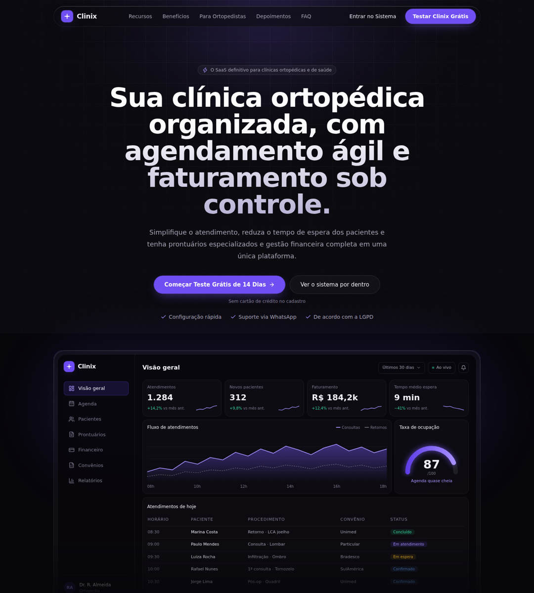

# Clinix — Landing Page

Landing page do **Clinix**, SaaS de gestão para clínicas e consultórios de todas as especialidades.
React 18 + Vite + Tailwind CSS 3 + lucide-react. Tema escuro com vidro, brilho violeta e grão sutil.



## Rodando

```bash
npm install
npm run dev      # http://localhost:5173
npm run build    # gera dist/
```

## Estrutura

| Arquivo | O que é |
| --- | --- |
| `ClinixLanding.tsx` | A página inteira: header, hero com mockup do dashboard, problema × solução, recursos, especialidades, fluxo do paciente, depoimentos, preços, FAQ, CTA final e rodapé |
| `index.css` | Fontes (Inter / Inter Tight), `.glass`, `.btn-primary`, `.btn-ghost`, `.eyebrow`, `.grain`, `.bg-grid`, `.text-gradient` |
| `tailwind.config.ts` | Tokens de cor `clx-*`, fontes, sombras e animações |
| `COMO-USAR-NO-LOVABLE.md` | Como levar a página para um projeto Lovable |

## Antes de publicar

Depoimentos, logos de parceiros, preços e números do mockup são **conteúdo de exemplo** — substitua por dados reais e autorizados. Troque também o link do WhatsApp (`https://wa.me/`) e o logo provisório no componente `Logo`.
